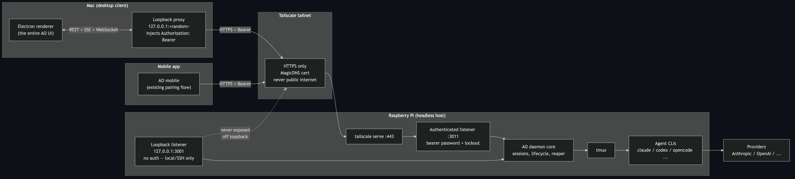
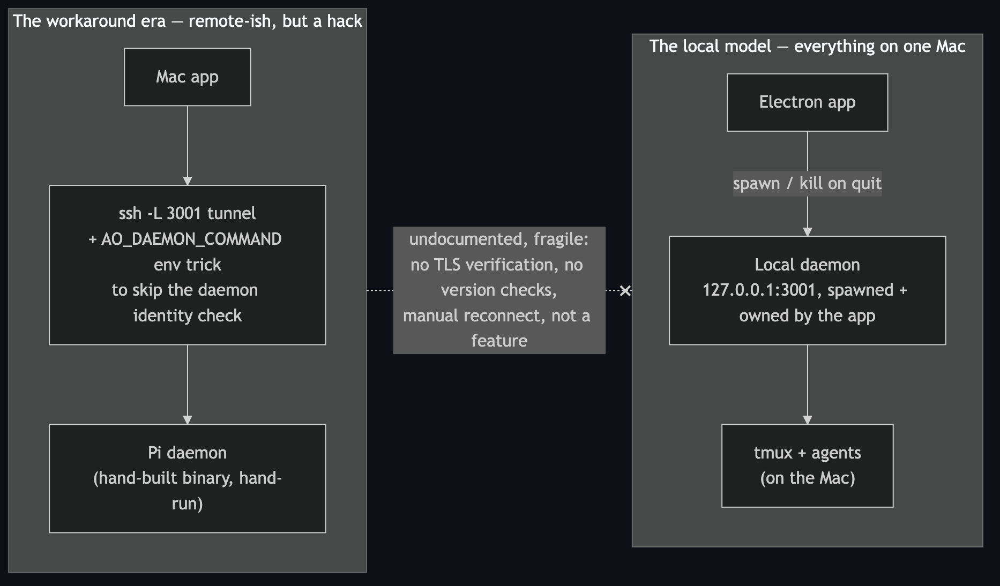
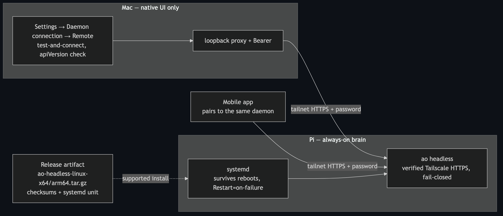
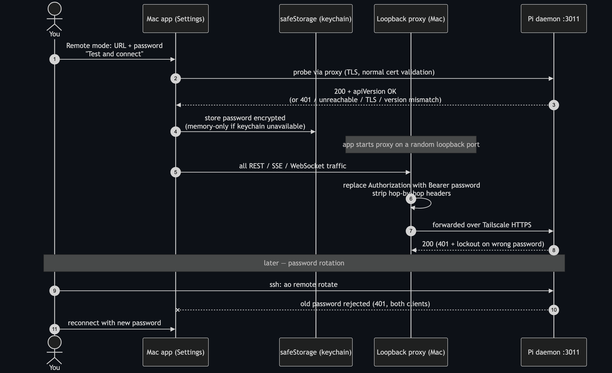
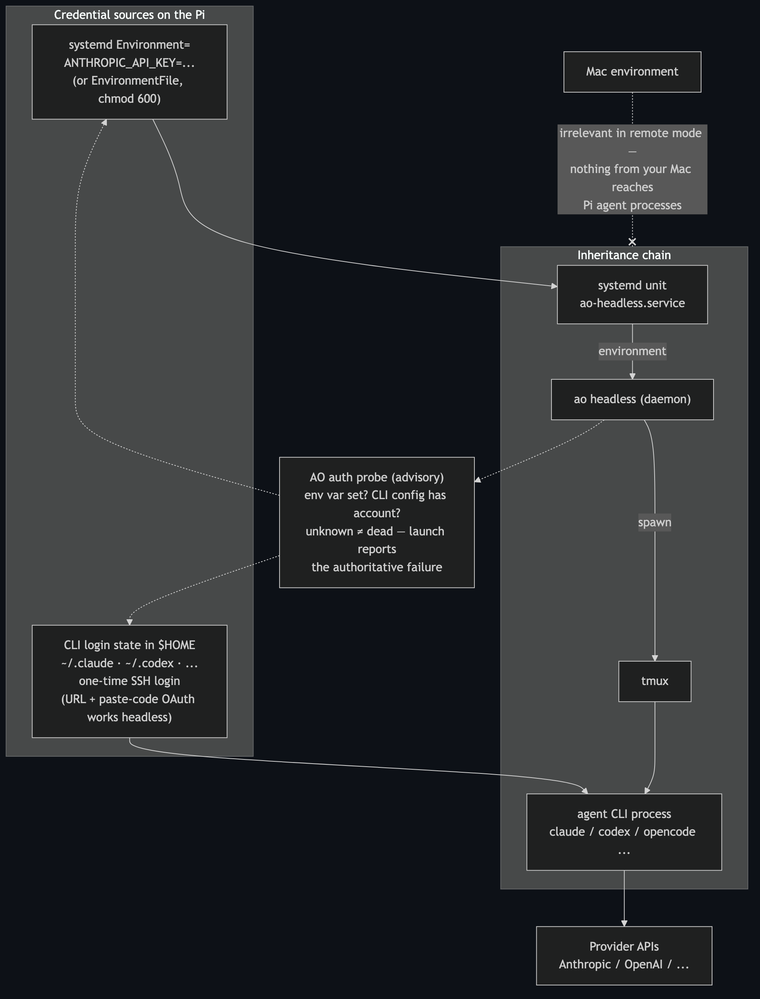
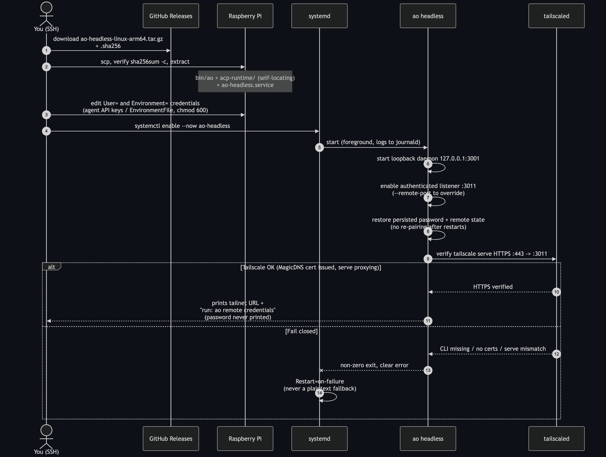

# Headless AO: architecture and decisions

How AO learned to run as an always-on daemon on a server or Raspberry Pi —
managed from any browser, the Mac desktop app, or the mobile app, all over
Tailscale. This document explains what was built, why each decision was made,
and what the verification layers caught before users could.

Audience: founders, reviewers, and future maintainers. Every claim maps to
code that exists today; key files and commits are cited inline.

---

## TL;DR

A Raspberry Pi (or any Linux box) now runs `ao headless` under systemd. That
single command starts the normal AO daemon, enables its authenticated remote
listener, proves end-to-end HTTPS through `tailscale serve` — or refuses to
start — and prints one URL: `https://<host>.<tailnet>.ts.net`. That URL is at
once:

- a **full browser dashboard** (password → sessions, Chat, terminals, PRs,
  reviews — no desktop app needed),
- the **Mac desktop app's** remote daemon (Settings → Daemon connection),
- the **mobile app's** pairing target (unchanged flow).

One shared password protects all three. Rotating it (`ao remote rotate`)
instantly invalidates every client of every kind. The primary loopback
listener and everything agents do are untouched.

---

## Before → after

**The local model (what AO always was):** the Electron app spawns and owns a
loopback daemon on the same machine; agents run on that machine; quitting the
app can stop the daemon. Remote operation simply didn't exist — the only
remote-ish feature was mobile pairing (ADR 0001).

**The workaround era:** running the daemon on another machine was possible
only by hand — an `ssh -L 3001` tunnel plus the `AO_DAEMON_COMMAND` env trick
that silences the app's daemon-identity check. Undocumented, fragile, no TLS
verification, no version checks, manual reconnects. A hack, not a feature.

**Now:** the daemon is a first-class headless citizen with a supported
install artifact, a fail-closed startup contract, and three equal clients.

---

## The two auth planes (the mental model that shapes everything)

Most confusion about this system comes from conflating two unrelated
credential flows. They are independent on purpose:

**Plane 1 — you ↔ the daemon.** How a *client* proves itself to AO. One
shared connection password, presented as an `Authorization: Bearer` token
(desktop, mobile) or exchanged once for a signed browser cookie (dashboard).
It travels only inside tailnet HTTPS. This is what `ao remote credentials`
prints and `ao remote rotate` rotates.

**Plane 2 — the daemon ↔ agent providers.** How `claude`, `codex`,
`kilocode`, etc. prove themselves to Anthropic/OpenAI/z.ai. **AO never
brokers this.** The daemon spawns agent CLIs as child processes
(daemon → tmux → agent), and they inherit its environment and `$HOME`. So
agent auth on a headless host is exactly what each CLI already does on any
server: API keys via the systemd unit (`Environment=ANTHROPIC_API_KEY=...`
or a `chmod 600` EnvironmentFile), or CLI login state in `$HOME`
(`~/.claude`, `~/.codex`, kilo's `~/.local/share/kilo/auth.json`) seeded by a
one-time SSH login. AO's auth probe checks these same sources, advisedly.

Nothing about your Mac's credentials ever reaches the Pi's agents, and
nothing about agent keys ever reaches the dashboard. Verified end-to-end: a
dummy `ANTHROPIC_API_KEY` set as a container env var traveled
container → daemon → tmux → claude-code → Anthropic and came back as the
provider's own 401; a real z.ai key completed a live `ok` reply through
kilocode — both inside the Docker e2e harness.

---

## What changed, layer by layer

### Backend — `ao headless`, `ao remote`, API version (PR 1)

Commits `47b5a0548` (+ merge upkeep) on `feat/headless-remote-daemon`.

- **`ao headless`** is a foreground, systemd-friendly entrypoint
  (`backend/internal/cli/headless.go`, `backend/internal/daemon/headless.go`).
  Boot contract: start the normal loopback daemon → enable the authenticated
  listener (default `:3011`, `--remote-port` to override) → restore the
  persisted password/listener state (no re-pairing across restarts) →
  **verify** `tailscale serve` actually proxies HTTPS to that listener → only
  then print readiness. Any failure — no tailscale CLI, no MagicDNS name, no
  cert domain, serve target mismatch — exits non-zero with a precise error.
  **There is no plaintext fallback, by design.**
- **`ao remote status|credentials|rotate|enable|disable [--json]`** — thin
  loopback CLI over the existing `/api/v1/mobile/*` routes, with generalized
  "remote access" language. The password is printed only by an explicit
  `credentials` call, never in banners or logs.
- **`apiVersion`** in `/healthz` and `/readyz` (`daemonmeta.APIVersion = 1`)
  so clients detect version drift at connect time instead of dying on a
  random route later.

**Key decision: build on the existing authenticated listener, not a new
socket.** The mobile feature already shipped exactly the right boundary
(ADR 0001): an opt-in `0.0.0.0` listener behind a shared password with
per-source lockout, while the primary listener stays `127.0.0.1`-only and
unauthenticated forever. Everything remote — desktop, dashboard, mobile —
rides that one listener. Invariants kept untouched: the loopback bind, the
loopback-only control routes (`/shutdown`, telemetry, mobile admin, dev,
browser control stay 404 on the LAN side), and mobile pairing behavior.

### Desktop — remote-daemon mode (PR 1)

Commit `275772e1a` on `feat/headless-remote-daemon`.

- Settings → Daemon connection: Local (default) or Remote (one HTTPS root
  URL + password), strict URL validation, Test-and-connect / Disconnect /
  Forget.
- **Why a loopback forwarding proxy** (`frontend/src/main/remote-proxy.ts`)
  instead of pointing the renderer at the remote URL directly: the app's
  entire transport layer (REST, SSE, terminal WebSocket) already targets a
  loopback base URL with an origin the daemon's CORS allowlist trusts. A
  random-port loopback proxy that forwards to the tailnet URL — injecting
  `Authorization: Bearer`, stripping hop-by-hop headers, never following
  redirects, bridging `/mux` WebSockets — means **zero renderer changes** and
  the password never appears in any URL, log, telemetry payload, or WebSocket
  query string. It lands in the OS keychain via Electron `safeStorage`
  (memory-only fallback), and the renderer only ever learns `hasPassword`.
- **Ownership rules:** in remote mode the app never inspects `running.json`,
  spawns a local daemon, identity-checks, or calls remote `/shutdown`.
  Quitting the app only closes its proxy — the Pi's daemon outlives it.
- **Feature gates:** machine-local affordances are replaced, not silently
  broken — explicit absolute-path entry instead of directory pickers, file
  drop disabled, Electron browser preview off, mobile-admin UI hidden (those
  routes are loopback-only anyway).

### Browser dashboard (this branch)

Commits on `feat/headless-web-dashboard`
(`3596513ca` backend, `4555e6379` frontend, `0f164708f` embed, `66ef3bb4f`
embed fix, `9d9b26b51` e2e gate).

- **Served from the authenticated listener — no new socket, no new trust
  boundary.** The SPA shell and its assets are public (the login page lives
  in the SPA); every API/SSE/WebSocket call past that requires credentials.
  LAN-only routes (`backend/internal/httpd/webdash.go`): `GET /auth/session`,
  `POST /auth/login`, `POST /auth/logout`, plus static serving of the
  embedded bundle.
- **Cookie design** (`backend/internal/httpd/web_session.go`):
  `ao_web_session` — 24h, `Secure`, `HttpOnly`, `SameSite=Strict`,
  HMAC-SHA256-signed claims carrying the password hash it was issued against.
  Because the middleware always validates against the *current* hash,
  **password rotation invalidates every browser session for free**, at the
  same instant bearers die. The signing key is a random 32-byte secret
  persisted mode `0600` under `~/.ao/mobile/`, so sessions survive daemon
  restarts (matching "restart restores without re-pairing").
- **Login lives outside `authMiddleware` but inside the shared lockout** (5
  failures → 1-minute 429, same as bearer). A subtle companion decision:
  **a stale/expired cookie never counts toward the lockout** — otherwise a
  rotated-out browser would lock itself out of the login page it needs to
  recover. Only presented guesses (bad bearer tokens, credential-free probes)
  count.
- **CSRF/CSWSH:** cookie-authenticated mutations require a same-origin
  `Origin` (or `Sec-Fetch-Site: same-origin`); the `/mux` upgrade re-checks
  origin for cookie-authed requests; CORS admits the serving tailnet origin
  while the static allowlist is untouched. Bearer clients are unaffected.
- **`VITE_AO_WEB=1` is a real mode, not the mock preview.** It shares nothing
  with `VITE_NO_ELECTRON` except the build system: same-origin transports off
  `window.location.origin`, a `WebGate` that mounts **nothing** (no queries,
  no SSE, no sockets) until `/auth/session` confirms the cookie, and a
  synthesized `ready/remote` status so every existing remote feature gate
  engages unchanged.
- **Hash routing means no SPA fallback.** The renderer has always been
  hash-routed (Electron is `file://`), so deep links and refreshes only ever
  request `/` — a free win for serving.
- **CSP:** strict same-origin (`connect-src 'self'`, which per CSP3 covers
  same-origin `wss:`), and **no telemetry origins** — a tailnet dashboard
  does not phone home.

### Distribution

- Headless tarballs `ao-headless-linux-{x64,arm64}.tar.gz` (on
  `feat/headless-release-docs`): `bin/ao` + bundled ACP runtime (Node +
  claude-agent-acp, so Chat providers need zero setup) + systemd unit +
  checksums, built host-native on real ARM runners in CI.
- The web bundle is a **committed generated artifact**
  (`backend/internal/httpd/webassets/dist`, synced by
  `scripts/sync-web-assets.sh`), embedded via `//go:embed all:` and
  drift-checked in CI (`web-drift` job) — same convention as
  `apispec/openapi.yaml`.

---

## What verification actually caught

Each test layer exists because the one before it missed something real:

| Layer | Bug it caught |
| --- | --- |
| Fork CI on a real ARM runner | Archive named `aarch64` where the workflow expected `arm64` — invisible on macOS, where `uname -m` already says `arm64` |
| Upstream PR CI (`typecheck:e2e`) | The e2e fake bridge lacked the new required `remote` namespace — our local `typecheck` never covered that tree |
| Docker cross-machine gate | **`go:embed` silently dropped every `_shell-*.js` lazy route chunk** — the shipped dashboard would have crashed on first navigation after login. Fixed with `all:` + regression test |
| Docker agent-auth e2e | kilo's built-in z.ai provider ignores `ZAI_API_KEY` env; it needs `auth.json` seeded (and a model pin — the auto-picked GLM-5V-Turbo wasn't on the key's plan) |
| Same harness, positive proof | env var → daemon → tmux → agent → provider, both directions: Anthropic 401 (dummy key) and a live z.ai `ok` (real key) |

The verification stack today: backend/frontend unit suites, `go vet`,
golangci-lint, fork CI (real ARM64 archive self-test), upstream PR CI,
a headless boot + agent-auth Docker suite, and the three-stage cross-machine
browser gate (`test/web-dashboard/run.sh`: unauth → login → project →
session → SSE → mux → logout → rotation → restart durability).

---

## Explicit non-goals

- **No Tailscale Funnel, no public-internet exposure.** The dashboard URL is
  tailnet-only by construction; the one network-facing bind stays behind the
  password + lockout, and HTTPS is provided by the tailnet itself.
- **No multi-user / RBAC.** One shared password, one trusted tailnet.
  Per-user accounts are a separate product decision.
- **No Electron browser automation or cross-machine file transfer in web
  mode** — those bridges are machine-local; the UI explains instead of
  failing mysteriously.
- **The primary loopback listener is untouched** — unauthenticated,
  `127.0.0.1`-only, exactly as AGENTS.md mandates.

---

## Branch/commit map and status

- **`feat/headless-remote-daemon`** — backend headless mode + CLI + API
  version (`47b5a0548`), desktop remote mode (`275772e1a`), e2e fake-bridge
  fix (`0631ce9cd`), merges current with upstream `main`. **Open as upstream
  PR #4084**, CI green, mergeable.
- **`feat/headless-release-docs`** — headless release archives + CI
  (`6221fa6a7`, `e91ed5f4b`, `5f07f9e58`), remote-daemon docs + ADR 0003
  (`f219982b5`), dashboard-in-archive + browser docs (`8f27a335f`).
- **`feat/headless-web-dashboard`** — the browser dashboard end to end
  (`3596513ca`, `4555e6379`, `0f164708f`, `66ef3bb4f`, `9d9b26b51`).

**Remaining:** W5 real-machine smoke — install the release archive on a fresh
Ubuntu VM (and Pi when hardware is available) on the real tailnet, drive the
acceptance flow from a second physical device, confirm off-LAN reachability
and out-of-tailnet unreachability. Then PRs 2 and 3.
